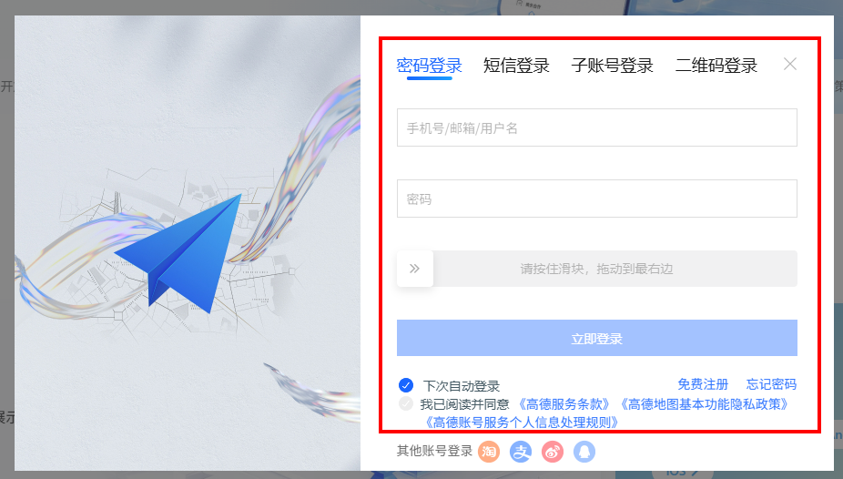
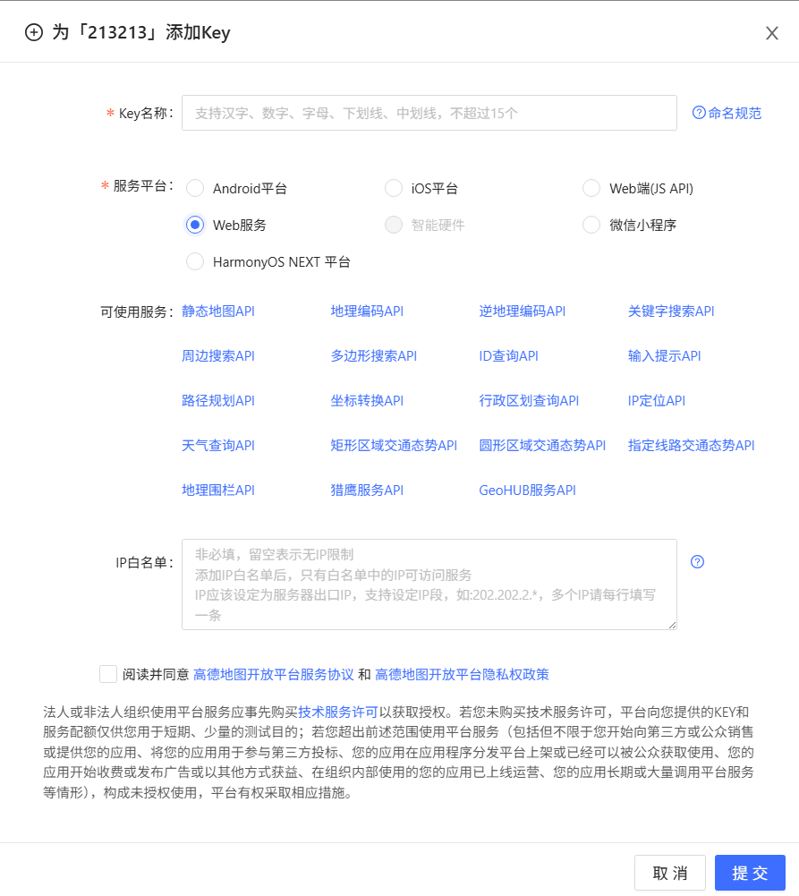
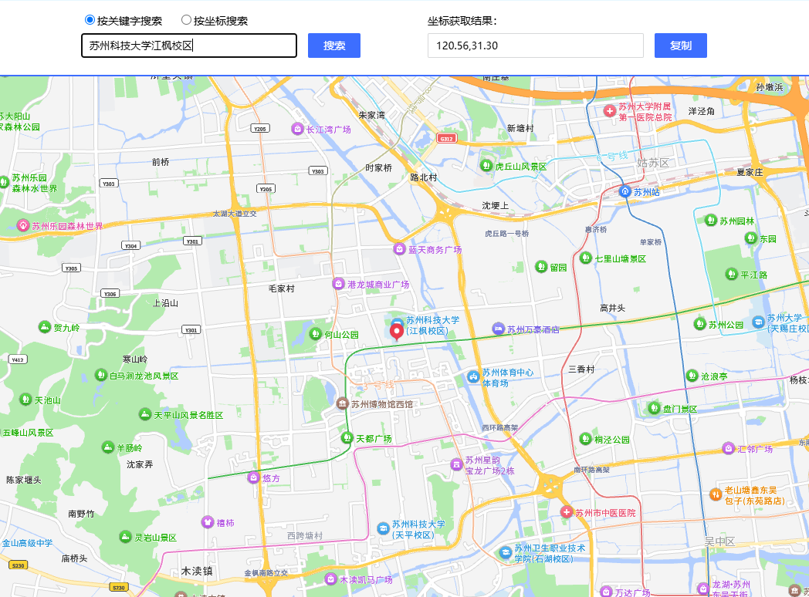
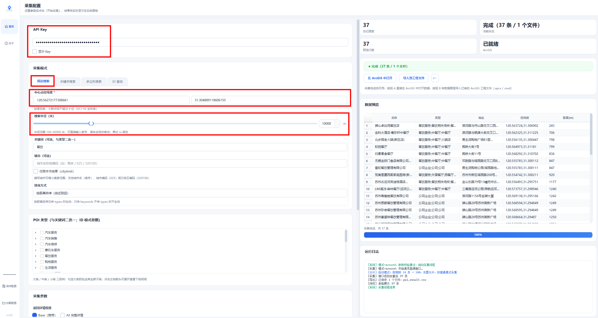
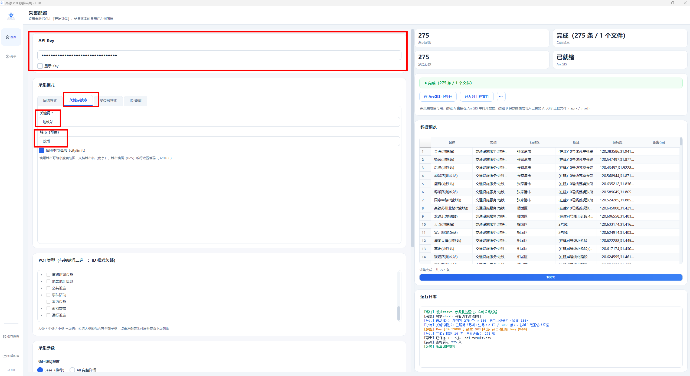
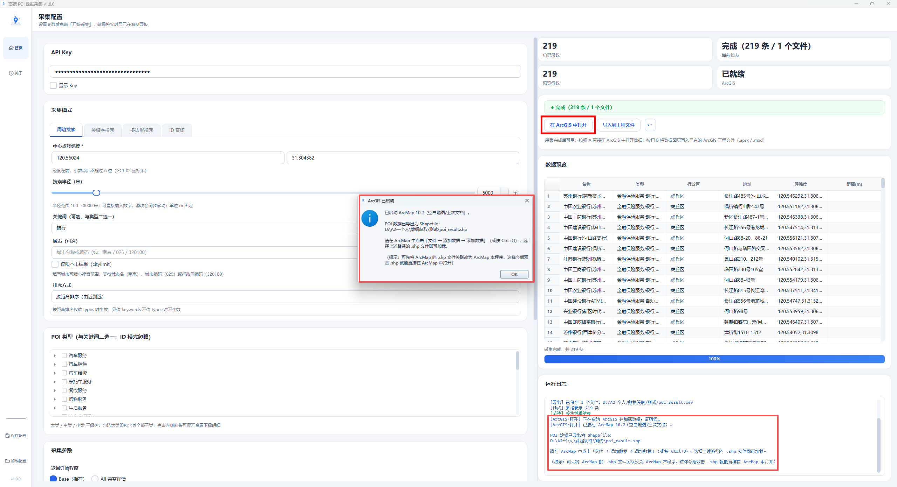
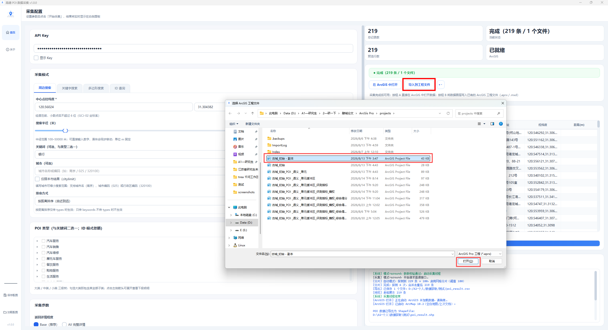
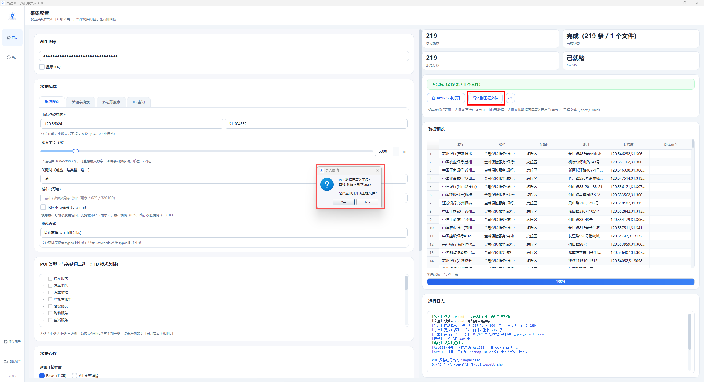

<p align="center">
  
</p>

<h1 align="center">POICollector · 高德 POI 数据采集工具</h1>

<p align="center">
  <b>基于高德地图 Web 服务 API 的桌面端 POI 采集、整理与 ArcGIS 导入工具</b>
</p>

<p align="center">
  <a href="LICENSE"></a>
  <a href="https://www.python.org/downloads/"></a>
  <a href="https://www.qt.io/qt-for-python"></a>
</p>

<p align="center">
  <a href="README.md"></a>
  <a href="README_EN.md"></a>
</p>

<p align="center">
  <a href="#features">功能特性</a> ·
  <a href="#quick-start">快速开始</a> ·
  <a href="#arcgis">ArcGIS 导入</a> ·
  <a href="#usage">使用指南</a> ·
  <a href="#project-structure">项目结构</a> ·
  <a href="#development">开发文档</a> ·
  <a href="#acknowledgements">致谢与第三方</a>
</p>

---

<a id="features"></a>

## ✨ 功能特性

- **ArcGIS 双通道直连（核心亮点）**：采集完成后，可一键导出 Shapefile 并在 ArcGIS / ArcGIS Pro 中打开；也可直接把本次结果写入已有 `.aprx` / `.mxd` 工程。
- **四种采集模式**：周边搜索、关键字搜索、多边形搜索、POI ID 详情查询。
- **网格分片突破上限**：周边 / 多边形 / 关键词搜索均可自动切分区域，突破高德同参数约 200 条返回上限；关键词按城市行政区边界切格。
- **多 Key 配额感知**：多个 Key 自动轮询分摊 QPS 限流，配额耗尽自动切换。
- **五格式导出**：CSV / Excel / GeoJSON / JSON / Shapefile，空间数据统一导出为 WGS-84 坐标。
- **断点续采与去重**：中断后可按同参数续采，并自动合并去重。

<a id="download"></a>

## 📥 下载与安装

- **下载 v1.0.0**：前往 [POICollector v1.0.0 Release](https://github.com/joey6657-6657/POICollector/releases/tag/v1.0.0)，在 Assets 中下载 `POICollector.exe`。
- **无需 Python 环境**：发布的 EXE 内置解释器与依赖，双击即可使用。
- **SHA-256**：`0E46E721CFF52C3C2A8BA218D620516DD06D935FBBD533B3E36C405D572F1AC5`
- **首次运行提示**：软件没有代码签名，Windows SmartScreen 可能提示拦截；请只从本仓库 Release 下载并核对 SHA-256。

<a id="scope"></a>

## 使用范围与数据处理

本项目仅供**个人学习和科研**使用。请勿将其用于批量抓取、长期存储、转售或再分发通过高德服务获得的数据；请自行遵守所使用服务的条款、配额和适用法律法规。

<a id="preparation"></a>

## 🔑 使用前准备

| 前置条件 | 说明 |
|---|---|
| 操作系统 | Windows 10 / 11（64 位） |
| 高德 Web 服务 Key | 免费申请，必填 |
| ArcGIS（可选） | 使用 ArcGIS 直连功能时，需要本机安装 ArcGIS Pro 或 ArcMap |

**申请 Key 步骤：**

1. 打开 [高德开放平台控制台](https://console.amap.com/dev/key/app)。
2. 登录 / 注册（免费）。
3. 点击「+ 创建新 Key」，**服务平台务必选「Web 服务」**。
4. 复制生成的 Key；请使用自己的 Key，不要提交、分享或写入截图。

<p align="center">
  
  
</p>
<p align="center">
  
  
</p>

> 💡 建议每人使用自己的 Key。需要处理较大区域时，可申请 2～3 个 Key 配合网格分片使用。

<a id="quick-start"></a>

## 🚀 快速开始

### 示例一：采集苏州科技大学江枫校区附近的餐饮

1. 在 [高德坐标拾取器](https://lbs.amap.com/tools/picker) 搜索“苏州科技大学江枫校区”，点击地图取得 GCJ-02 坐标（约 `120.565,31.300`）。

<p align="center">
  
</p>

2. 切换到「周边搜索」：城市填 `苏州`，经度 `120.565`，纬度 `31.300`，半径 `2000`。
3. 关键词填 `餐饮`（或在 POI 类型勾选“餐饮服务”），选择输出路径后点击「开始采集」。

<p align="center">
  
</p>

### 示例二：采集苏州市地铁站

1. 切换到「关键字搜索」：城市填 `苏州`，关键词填 `地铁站`。
2. 「自动网格分片」保持默认自动，点击「开始采集」。
3. 当结果达到阈值时，工具会解析苏州行政区边界，逐网格采集、合并并去重，以避免单次查询的约 200 条上限。

<p align="center">
  
</p>

<a id="arcgis"></a>

## 🗺️ 一键导入 ArcGIS（核心亮点）

采集完成后，结果区域会出现两个 ArcGIS 操作按钮。这是本项目区别于一般 POI 导出工具的工作流：无需手工寻找导出文件，即可继续进入 GIS 制图或工程整理。

<p align="center">
  
</p>

| 按钮 | 适合的场景 | 执行结果 |
|---|---|---|
| **按钮 A · 在 ArcGIS 中打开** | 希望立刻查看本次采集结果 | 自动导出 Shapefile，启动本机 ArcGIS / ArcGIS Pro，并提示数据文件路径与加载方式 |
| **按钮 B · 导入到工程文件** | 希望把结果写入已有项目 | 选择 `.aprx` 或 `.mxd` 后，将本次 POI 作为新图层导入；完成后可选择立即打开工程 |

### 按钮 A：在 ArcGIS 中打开

点击按钮 A 后，软件会导出本次结果为 Shapefile，并启动检测到的 ArcGIS / ArcMap。弹窗和运行日志会给出导出路径及加载提示，便于确认结果已经交给 ArcGIS。

<p align="center">
  
</p>

### 按钮 B：导入到工程文件

点击按钮 B，先在文件选择器中指定已有 ArcGIS Pro 工程（`.aprx`）或 ArcMap 文档（`.mxd`）；软件把 POI 结果写入该工程后，会询问是否立即打开。

<p align="center">
  
  
</p>

> **前提与说明**：本机需安装 ArcGIS Pro 或 ArcMap；按钮 B 还需要 ArcGIS 自带 Python（`arcpy`）可被调用。ArcGIS Pro 首次使用前请先启动并登录一次。软件不包含 ArcGIS。

<a id="usage"></a>

## 📋 使用指南：采集与导出

### 四种采集模式

| 模式 | 说明 | 必填参数 |
|---|---|---|
| 周边搜索 | 以坐标点为中心、指定半径内搜索 | 经纬度 / 半径（m），城市可选 |
| 关键字搜索 | 按关键词搜索；填写城市可限定范围 | 关键词；使用分片时必须填写城市 |
| 多边形搜索 | 自定义多边形区域内搜索，支持 AOI 导入 | 多边形顶点（每行一个 `经度,纬度`） |
| ID 查询 | 根据 POI ID 获取详情 | POI ID |

**通用设置：**

- **API Key**：支持多个（英文逗号分隔），自动轮询分摊限流。
- **POI 类型**：三级树（大类 / 中类 / 小类，共 915 项）；勾选大类即包含全部子类。
- **每页条数**：1～25；工具自动翻页，同参数最多约 200 条。
- **自动网格分片**：关闭 / 自动 / 手动三种模式，适用于周边 / 多边形 / 关键词搜索；关键词分片需指定城市。
- **导出格式**：可多选，按所选格式分别生成同名文件。

### 导出格式

| 格式 | 说明 |
|---|---|
| CSV | Excel / WPS 可直接打开，UTF-8 编码 |
| Excel | `.xlsx`，含格式化表头 |
| GeoJSON | QGIS / ArcGIS 可打开，**WGS-84** 坐标系 |
| JSON | 原始数组，便于二次开发 |
| Shapefile | 生成 `.shp/.shx/.dbf/.prj` 四件套，**WGS-84** 坐标系 |

所有导出均含名称、类型、地址、WGS-84 经纬度、电话、行政区、距离、评分、人均消费等字段。

> ⚠️ 高德返回的是 GCJ-02（火星坐标）；软件会转换为 WGS-84 后再导出空间数据。

<a id="project-structure"></a>

## 📁 项目结构

```
POICollector/
├── run.py                      # 程序入口
├── POICollector.spec           # PyInstaller 打包配置
├── README.md                   # 中文主文档
├── README_EN.md                # English README
├── requirements.txt            # 运行时 Python 依赖
├── requirements-dev.txt        # 开发/测试依赖
├── requirements-lock.txt       # v1.0.0 已验证的完整环境
├── LICENSE / LICENSES/         # 本项目与第三方许可证材料
├── .github/                    # CI、Issue 模板与社区规范
├── docs/                       # 更新日志与 Release 文档
├── screenshots/                # README 配图与操作演示
├── assets/                     # 图标资源
├── poi_collector/
│   ├── core/                   # API、分页、分片、断点、ArcGIS 桥接等核心逻辑
│   ├── data/                   # 去重、导出与 POI 分类数据
│   └── gui/                    # PySide6 图形界面与后台采集线程
├── tools/                      # 图标与可选发行归档脚本
└── tests/                      # 离线核心逻辑测试
```

<a id="development"></a>

## 🛠️ 开发文档

```bash
# 1. 创建虚拟环境（需 Python 3.13+）
python -m venv venv
venv\Scripts\activate

# 2. 安装运行依赖
pip install -r requirements.txt

# 3. 如需运行测试，安装开发依赖并执行离线测试
pip install -r requirements-dev.txt
python -m pytest -q

# 4. 运行（开发模式）
python run.py

# 5. 打包为单文件 EXE（输出 dist/POICollector.exe）
pyinstaller POICollector.spec --noconfirm

# 6. （可选）生成含许可证材料的发行归档包
powershell -ExecutionPolicy Bypass -File tools\package_release.ps1 -Version 1.0.0
```

## 📄 许可证

本项目自行编写的代码基于 [MIT License](LICENSE) 开源。下方「致谢与第三方说明」区分了改编代码、思路参考、数据来源和运行时依赖；随 EXE 发行时还应一并提供 [LICENSES/](LICENSES/) 中的许可证材料。

Copyright (c) 2026 joey6657-6657

<a id="acknowledgements"></a>

## 🙏 致谢

感谢以下开源项目、数据服务和开发协作工具。本节同时是本项目的第三方声明：它明确区分了改编代码与仅参考的思路，避免把概念借鉴误写成代码复制。

### 已改编的代码

#### [wandergis/coordTransform_py](https://github.com/wandergis/coordTransform_py)

- **使用范围**：<code>poi_collector/core/coord_transform.py</code> 中 GCJ-02、WGS-84、BD-09 的转换公式与实现结构。

- **许可证**：MIT License；原始版权声明为 Copyright (c) 2015 WangMing。
- **随附文本**：[LICENSES/MIT-wandergis-coordTransform_py.txt](LICENSES/MIT-wandergis-coordTransform_py.txt)。

### 仅参考的算法或产品思路

#### [zdbpython/GaoDe-poi-crawler](https://github.com/zdbpython/GaoDe-poi-crawler)

- **参考内容**：用网格 / 四叉树递归拆分搜索区域、以小区域查询规避单次返回上限的思路。
- **本项目对应文件**：<code>poi_collector/core/splitter.py</code>。
- **边界**：本项目自行实现了几何计算、网格拆分、采集编排与去重流程；未复制或改编该仓库代码。

#### [Davydxm/AMapPoi](https://github.com/Davydxm/AMapPoi)（POIKit）

- **参考内容**：“网格四分 / 网格剖分”这一产品和算法概念。
- **边界**：未复制或改编其 Java 代码，也未将其代码纳入本项目；因此本项目不以该仓库作为代码许可证来源。

### 数据与运行时依赖

- **高德开放平台（AMap）**：<code>poi_collector/data/poi_types.json</code> 来自高德 POI 分类资料，程序通过其 Web 服务 API 请求数据。该数据和 API 内容不因本项目使用 MIT License 而被重新授权。
- **PySide6 / Qt**：桌面界面运行时使用 PySide6。发行 Windows EXE 时应一并提供 <code>LICENSES/</code> 中的 LGPL / GPL 文本及相关告知材料，具体见 [LICENSES/README.md](LICENSES/README.md)。
- **其他 Python 依赖**：版本清单见 [requirements-lock.txt](requirements-lock.txt)，各依赖保留各自的版权和许可证。

### 开发协作工具

开发过程中曾使用以下模型协助进行需求梳理、文档审阅、测试思路和代码讨论：**ChatGPT 5.6 Terra、Qwen3.8 Max、HY3、GLM 5.2、DeepSeek V4 Flash**。最终代码、文档和发布内容均由项目维护者审阅并决定。

### 贡献者

- [@joey6657-6657](https://github.com/joey6657-6657) — 项目创建、功能开发与维护
- 联系邮箱：[2842853418@qq.com](mailto:2842853418@qq.com)
