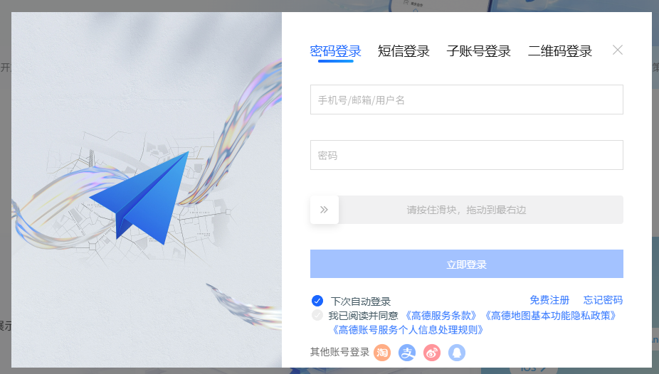
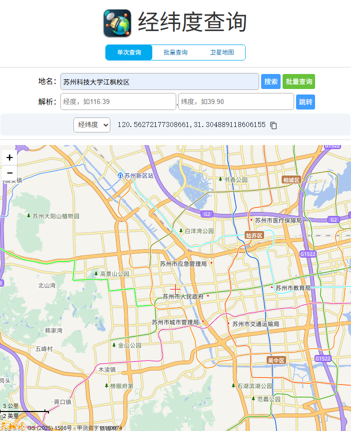
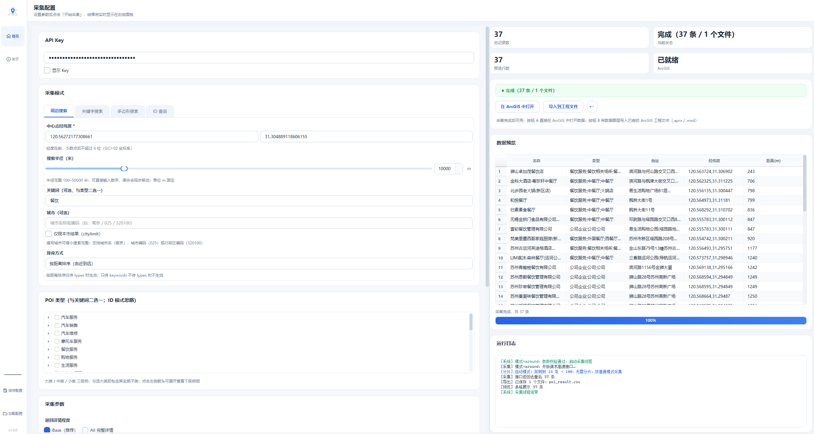
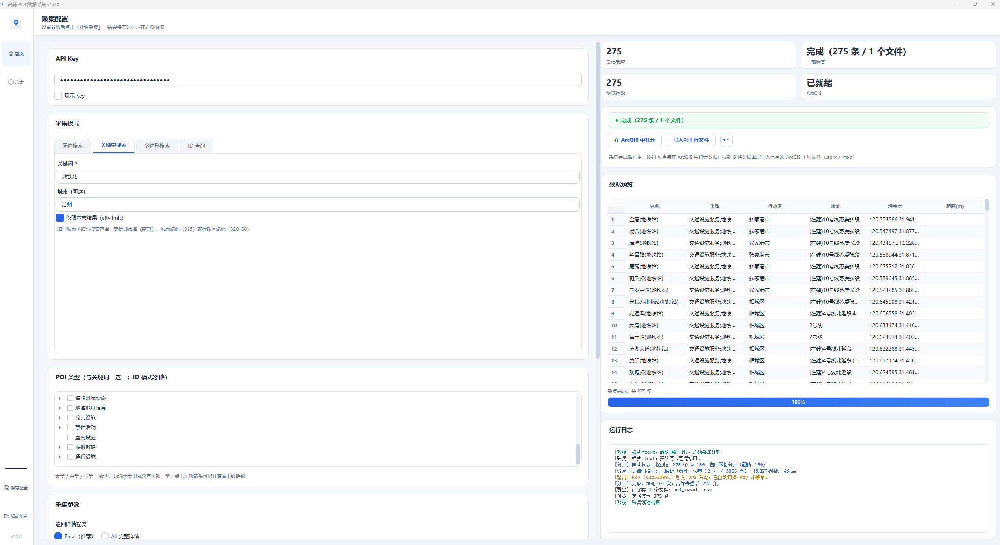

<p align="center">
  
</p>

<h1 align="center">POICollector · 高德 POI 数据采集工具</h1>

<p align="center">
  <b>基于高德地图 Web 服务 API 的桌面端 POI 采集工具</b><br>
  <b>AMap POI Collection Desktop Tool — PySide6 + PyInstaller Single-File EXE</b>
</p>

<p align="center">
  <a href="LICENSE"></a>
  <a href="https://www.python.org/downloads/"></a>
  <a href="https://www.qt.io/qt-for-python"></a>
</p>

<p align="center">
  <a href="#-中文"></a>
  <a href="#-english"></a>
</p>

---

<a id="-中文"></a>
<details open>
<summary><b>🇨🇳 中文 （点击收起）</b></summary>

## 📁 目录结构

```
POICollector/
├── run.py                      # 程序入口
├── POICollector.spec           # PyInstaller 打包配置
├── requirements.txt            # Python 依赖
├── LICENSE                     # MIT 许可证
├── README.md                   # 中英双语文档
├── 图片/                       # README 配图（申请 Key 流程与示例截图）
├── assets/                     # 图标资源
│   ├── logo.svg                #   矢量 logo 源文件
│   ├── logo.png                #   PNG logo（README 用）
│   └── logo.ico                #   Windows 多尺寸图标
├── poi_collector/              # 主包
│   ├── __init__.py             #   版本号 v1.0.0
│   ├── core/                   #   核心逻辑
│   │   ├── amap_client.py      #     高德 API 客户端
│   │   ├── key_manager.py      #     多 Key 轮询管理
│   │   ├── paginator.py        #     翻页逻辑
│   │   ├── splitter.py         #     网格四分片算法
│   │   ├── coord_transform.py  #     坐标系转换 (GCJ02↔WGS84↔BD09)
│   │   ├── retry_engine.py     #     指数退避重试
│   │   ├── checkpoint.py       #     断点续爬
│   │   ├── recent_projects.py  #     最近工程记录
│   │   └── arcgis_bridge.py    #     ArcGIS 探测与调用
│   ├── data/                   #   数据处理与导出
│   │   ├── deduplicator.py     #     POI 去重
│   │   ├── exporter.py         #     五格式导出 (CSV/Excel/GeoJSON/JSON/SHP)
│   │   └── poi_types.json      #     915 项高德 POI 分类
│   └── gui/                    #   图形界面
│       ├── main_window.py      #     主窗口 + 关于页
│       ├── config_panel.py     #     配置面板
│       ├── results_panel.py    #     结果预览 + KPI + 进度
│       ├── styles.py           #     统一 QSS 样式
│       ├── widgets.py          #     自定义控件
│       └── worker.py           #     后台采集线程
├── tools/                      # 辅助工具
│   └── build_icon.py           #   SVG→ICO 图标生成
└── tests/                      # 单元测试
    └── test_core.py            #   核心逻辑测试
```

> `config/`、`output/`、`checkpoints/` 为运行时目录（已 gitignored），不在仓库中显示。

## ✨ 功能特性

- **四种采集模式**：周边搜索、关键字搜索、多边形搜索、POI ID 详情查询
- **网格分片突破上限**：周边 / 多边形 / 关键词搜索均可自动切分区域，突破高德同参数约 200 条返回上限（关键词分片按城市行政区边界切格）
- **多 Key 配额感知**：多个 Key 自动轮询分摊 QPS 限流，配额耗尽自动切换
- **五格式导出**：CSV / Excel / GeoJSON / JSON / Shapefile（均使用 WGS-84 坐标系）
- **一键导入 ArcGIS**：直接启动 ArcGIS / ArcGIS Pro 加载数据，或写入已有工程文件
- **断点续爬**：采集中断后可从断点继续，无需重头再来

## 📥 下载与安装

从 GitHub Releases 下载 `POICollector.exe`（约 75 MB，单文件、免安装）。

- **无需 Python 环境**：双击即用，内置解释器与所有依赖
- **首次运行提示**：Windows SmartScreen 可能拦截，属正常现象：

> 点击「更多信息」→「仍要运行」

（软件无代码签名证书，故会被拦截；选择信任即可）

## 🔑 使用前准备

| 前置条件 | 说明 |
|---|---|
| 操作系统 | Windows 10 / 11（64 位） |
| 高德 Web 服务 Key | 免费申请，必填 |

**申请 Key 步骤：**

1. 打开 [高德开放平台控制台](https://console.amap.com/dev/key/app)
2. 登录 / 注册（免费）
3. 点击「+ 创建新 Key」，**服务平台务必选「Web 服务」**
4. 复制生成的 32 位 Key（形如 `82c5...e3b5`）

各步骤界面参考：

<p float="left">
  
  
</p>
<p float="left">
  
  
</p>

> 💡 提示：每人用自己的 Key，不要共用。建议申请 2~3 个 Key 配合"网格分片"使用。

## 🚀 快速上手

### 示例一：采集苏州科技大学江枫校区附近的餐饮

1. 获取校区坐标：在 [高德坐标拾取器](https://lbs.amap.com/tools/picker) 搜索“苏州科技大学江枫校区”，点击地图即可拾取 GCJ-02 坐标（约 `120.565,31.300`）



2. 切换到「周边搜索」Tab → 城市填 `苏州`，经度 `120.565`，纬度 `31.300`，半径 `2000`
3. 关键词填 `餐饮`（或在 POI 类型勾选“餐饮服务”）→ 选好输出路径 → 点「开始采集」



### 示例二：采集苏州市地铁站

1. 切换到「关键字搜索」Tab → 城市填 `苏州`，关键词填 `地铁站`
2. 「自动网格分片」保持默认自动 → 点「开始采集」
3. 工具会先探测总数，≥180 条时自动解析苏州行政区边界、逐网格采集并合并去重，突破 200 条上限



## 📋 四种采集模式

| 模式 | 说明 | 必填参数 |
|---|---|---|
| 周边搜索 | 以坐标点为中心、指定半径内搜索 | 经纬度 / 半径(m)，城市可选 |
| 关键字搜索 | 按关键词搜索（填城市可限定范围） | 关键词；分片时必填城市 |
| 多边形搜索 | 自定义多边形区域内搜索，支持 AOI 导入 | 多边形顶点（每行一个 `经度,纬度`） |
| ID 查询 | 根据 POI ID 获取详情 | POI ID |

**通用设置：**

- **API Key**：支持多个（英文逗号分隔），自动轮询分摊限流
- **POI 类型**：三级树（大类/中类/小类，915 项），勾大类即含全部子类
- **每页条数**：1–25（高德官方单页上限 25，工具自动翻页，同参数最多约 200 条）
- **突破 200 条上限（网格分片）**：关闭 / 自动 / 手动三种模式；适用于周边 / 多边形 / 关键词搜索（关键词分片需指定城市），自动切分区域逐块采集、合并去重
- **导出格式**：可多选，按所选格式分别导出同名文件

## 📤 导出格式

| 格式 | 说明 |
|---|---|
| CSV | Excel / WPS 可直接打开，UTF-8 编码 |
| Excel | `.xlsx`，含格式化表头 |
| GeoJSON | QGIS / ArcGIS 可打开，**坐标系 WGS-84** |
| JSON | 原始数组，便于二次开发 |
| Shapefile | ESRI 规范，自动生成 `.shp/.shx/.dbf/.prj` 四件套，坐标系 WGS-84 |

所有导出均含：名称、类型、地址、经纬度(WGS-84)、电话、行政区、距离、评分、人均消费等字段。

> ⚠️ **坐标系说明**：高德返回 GCJ-02（火星坐标），软件自动转换为 WGS-84（GPS 标准）后导出。

## 🗺️ 一键导入 ArcGIS

前提：本机已安装 ArcGIS Pro 或 ArcMap（软件不含 ArcGIS）。软件自动扫描 C/D/E/F/G 盘识别安装。

| 按钮 | 功能 |
|---|---|
| **按钮 A · 在 ArcGIS 中打开** | 导出为 Shapefile 并直接启动本机 ArcGIS 加载数据 |
| **按钮 B · 导入到工程文件** | 将本次 POI 作为新图层写入已有工程（`.aprx` / `.mxd`） |

> 注意：按钮 B 需 ArcGIS 自带 Python(arcpy) 可外部调用；ArcGIS Pro 首次使用前请先启动并登录一次。

## 🛠️ 开发

```bash
# 1. 创建虚拟环境（需 Python 3.13+）
python -m venv venv
venv\Scripts\activate

# 2. 安装依赖
pip install -r requirements.txt

# 3. 运行（开发模式）
python run.py

# 4. 打包为单文件 exe（输出 dist/POICollector.exe）
pyinstaller POICollector.spec --noconfirm
```

图标资源位于 `assets/logo.svg`（真矢量源），由 `tools/build_icon.py` 渲染为多尺寸 `logo.ico`。

## 📄 许可证

本项目基于 [MIT License](LICENSE) 开源。

Copyright (c) 2026 joey6657-6657

## 🙏 致谢

本项目参考/借鉴了以下开源项目与数据源，详见 [THIRD-PARTY.md](THIRD-PARTY.md)。

</details>

---

<a id="-english"></a>
<details>
<summary><b>🇬🇧 English （Click to expand）</b></summary>

## 📁 Project Structure

```
POICollector/
├── run.py                      # Entry point
├── POICollector.spec           # PyInstaller build config
├── requirements.txt            # Python dependencies
├── LICENSE                     # MIT License
├── README.md                   # Bilingual documentation
├── 图片/                       # README screenshots (Key setup & examples)
├── assets/                     # Icon assets
│   ├── logo.svg                #   Vector logo source
│   ├── logo.png                #   PNG logo (for README)
│   └── logo.ico                #   Windows multi-size icon
├── poi_collector/              # Main package
│   ├── __init__.py             #   Version v1.0.0
│   ├── core/                   #   Core logic
│   │   ├── amap_client.py      #     AMap API client
│   │   ├── key_manager.py      #     Multi-key rotation
│   │   ├── paginator.py        #     Pagination logic
│   │   ├── splitter.py         #     Grid splitting algorithm
│   │   ├── coord_transform.py  #     Coord transform (GCJ02↔WGS84↔BD09)
│   │   ├── retry_engine.py     #     Exponential backoff retry
│   │   ├── checkpoint.py       #     Checkpoint resume
│   │   ├── recent_projects.py  #     Recent project records
│   │   └── arcgis_bridge.py    #     ArcGIS detection & invocation
│   ├── data/                   #   Data processing & export
│   │   ├── deduplicator.py     #     POI deduplication
│   │   ├── exporter.py         #     Five-format export (CSV/Excel/GeoJSON/JSON/SHP)
│   │   └── poi_types.json      #     915 AMap POI categories
│   └── gui/                    #   GUI
│       ├── main_window.py      #     Main window + About page
│       ├── config_panel.py     #     Configuration panel
│       ├── results_panel.py    #     Results preview + KPI + progress
│       ├── styles.py           #     Unified QSS styles
│       ├── widgets.py          #     Custom widgets
│       └── worker.py           #     Background collection thread
├── tools/                      # Utility tools
│   └── build_icon.py           #   SVG→ICO icon generator
└── tests/                      # Unit tests
    └── test_core.py            #   Core logic tests
```

> `config/`, `output/`, `checkpoints/` are runtime directories (gitignored) and not shown in the repository.

## Features

- **Four collection modes**: Nearby search, Keyword search, Polygon search, POI ID detail query
- **Grid splitting**: Available for nearby / polygon / keyword search — auto-splits the area to bypass AMap's ~200-result limit per query (keyword splitting grids by city administrative boundary)
- **Multi-key rotation**: Multiple keys rotate automatically to spread QPS throttling; switches when one is exhausted
- **Five export formats**: CSV / Excel / GeoJSON / JSON / Shapefile (all in WGS-84 coordinate system)
- **One-click ArcGIS integration**: Launch ArcGIS / ArcGIS Pro to load data, or write into an existing project file
- **Checkpoint resume**: Resume from the last checkpoint after interruption

## Download & Install

Download `POICollector.exe` (~75 MB, single file, no installation) from GitHub Releases.

- **No Python required** — the executable bundles the interpreter and all dependencies
- **First-run warning**: Windows SmartScreen may block it on first run — this is expected:

> Click **More info** → **Run anyway**

(The app is not code-signed, so the warning is expected — just choose to trust it.)

## Prerequisites

| Requirement | Details |
|---|---|
| OS | Windows 10 / 11 (64-bit) |
| AMap Web Service Key | Free registration, required |

**How to get a Key:**

1. Open the [AMap Open Platform console](https://console.amap.com/dev/key/app)
2. Log in / sign up (free)
3. Click **+ Create Key**, set **Service Platform = "Web Service"**
4. Copy the generated 32-character key (e.g., `82c5...e3b5`)

Screenshots for each step:

<p float="left">
  
  
</p>
<p float="left">
  
  
</p>

> **Tip**: Use your own key; do not share. We recommend 2–3 keys when using grid splitting.

## Quick Start

### Example 1: Restaurants near Jiangfeng Campus, Suzhou University of Science and Technology

1. Get the campus coordinates: search "苏州科技大学江枫校区" on the [AMap Coordinate Picker](https://lbs.amap.com/tools/picker) and click the map to pick GCJ-02 coordinates (about `120.565,31.300`)


2. Switch to **Nearby Search** tab → City: `苏州 (Suzhou)`, Longitude `120.565`, Latitude `31.300`, Radius `2000`
3. Keyword: `餐饮` (dining) — or check the “餐饮服务” POI category → choose output path → click **Start**


### Example 2: All metro stations in Suzhou

1. Switch to **Keyword Search** tab → City: `苏州 (Suzhou)`, Keyword: `地铁站` (metro station)
2. Keep **Auto grid splitting** on automatic (default) → click **Start**
3. The tool probes the total first; when ≥180 it parses Suzhou's administrative boundary, collects grid by grid and merges results, bypassing the 200-result limit


## Collection Modes

| Mode | Description | Required Fields |
|---|---|---|
| Nearby Search | Search within a radius of a coordinate point | Longitude-Latitude / Radius (m); city optional |
| Keyword Search | Search by keyword (city narrows the scope) | Keyword; city required when splitting |
| Polygon Search | Search within a custom polygon area; supports AOI import | Polygon vertices (one `lng,lat` per line) |
| ID Query | Get details by POI ID | POI ID |

**Common settings:**

- **API Key**: Supports multiple keys (comma-separated), auto-rotates for load balancing
- **POI Type**: Three-level tree (Category / Subcategory / Type, 915 entries); checking a parent selects all children
- **Page size**: 1–25 (official per-page limit is 25; the tool auto-paginates, up to ~200 results per query)
- **Grid splitting (bypass the 200 limit)**: off / auto / manual; available for nearby / polygon / keyword search (keyword splitting requires a city); auto-splits and merges results
- **Export formats**: Multi-select; one output file per selected format

## Export Formats

| Format | Notes |
|---|---|
| CSV | Open directly in Excel / WPS, UTF-8 encoded |
| Excel | `.xlsx` with formatted headers |
| GeoJSON | Open in QGIS / ArcGIS, **WGS-84 coordinate system** |
| JSON | Raw array for further processing |
| Shapefile | ESRI standard, auto-generates `.shp/.shx/.dbf/.prj` bundle, WGS-84 |

All exports include: name, type, address, WGS-84 coordinates, phone, district, distance, rating, average cost, etc.

> **Note on coordinates**: AMap returns GCJ-02 (Mars coordinates); the tool converts to WGS-84 (GPS standard) before export.

## One-click ArcGIS Integration

Requires ArcGIS Pro or ArcMap installed locally (not bundled). The tool auto-detects installations on drives C/D/E/F/G.

| Button | Function |
|---|---|
| **Button A · Open in ArcGIS** | Exports to Shapefile and launches local ArcGIS to load data |
| **Button B · Import to Project** | Writes POI as a new layer into an existing project (`.aprx` / `.mxd`) |

> Note: Button B requires arcpy callable from ArcGIS's Python; launch and sign in to ArcGIS Pro once before first use.

## Development

```bash
# 1. Create virtual environment (Python 3.13+ required)
python -m venv venv
venv\Scripts\activate

# 2. Install dependencies
pip install -r requirements.txt

# 3. Run (development mode)
python run.py

# 4. Package as single-file exe (output: dist/POICollector.exe)
pyinstaller POICollector.spec --noconfirm
```

Icon source: `assets/logo.svg` (vector); rendered into multi-size `logo.ico` by `tools/build_icon.py`.

## License

Released under the [MIT License](LICENSE).

Copyright (c) 2026 joey6657-6657

## 🙏 Acknowledgements

This project references the following open-source projects and data sources — see [THIRD-PARTY.md](THIRD-PARTY.md) for details.

</details>
